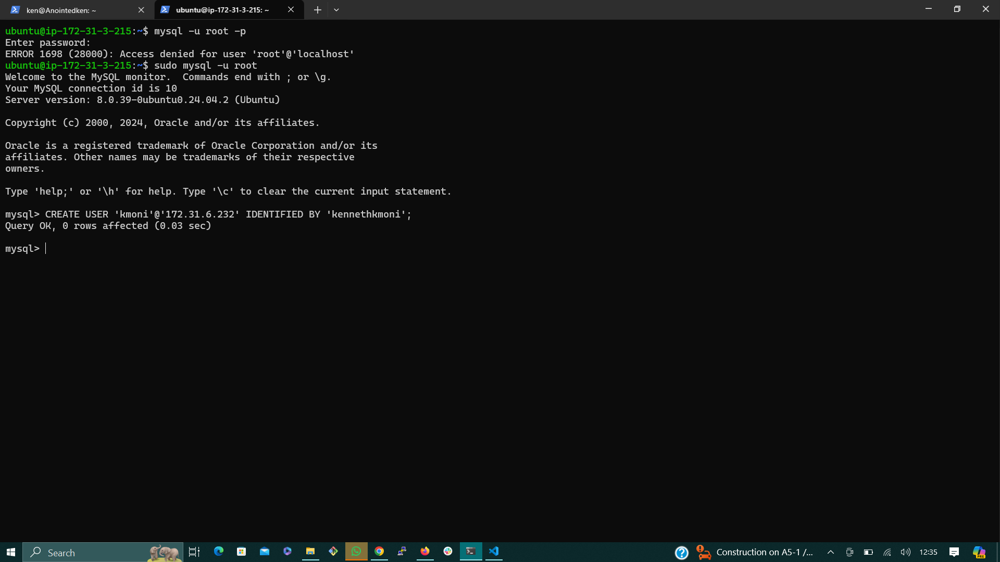
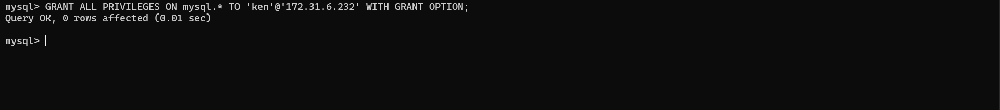

# TASK-Implement a Client Server Architect using MySQL Database Management System (DBMS)

To demmonstarted a basic client-server using MySQL RDBS, follow the bellow instructions

__1.__ Create and configure two Linux-base virtual servers (EC2 instances in AWS)

`Server A name -  'mysql server' `

`Server B name -  'mysql client'`


__2.__ On `mysql server` install MySQL server software

```
sudo apt-get update
sudo apt-get install mysql-server
```


__3.__ On `mysql client` Linux Server install MySQL client software.

```
sudo apt-get update
sudo apt-get install mysql-client
```


__4.__ Use  `mysql server's` local IP address to connect from `mysql client.` MySQL sever uses `TCP PORT 3306 ` by default. Hence, add a new in `Inbound rule` in `mysql server`


__5.__ On mysql server, Edit the mysql configuration file to allow remote connections; replace 127.0.0.1 to 0.0.0.0

```bash
sudo vi /etc/mysql/mysql.conf.d/mysqld.cnf
```


__6.__ From `mysql client` Linux Server connect remotely to `mysql server` Database Engine without using ssh. You must use the mysql utility to perform this action. We do this by:

__a.__ Create a remote user (on the server hosting the database): 
Use the mysql command-line tool on the server to create a new user with appropriate permissions for the client to access the database.

- Connect to the MySQL server locally:

```
mysql -u root -p
```


- Create a new user:
To create a new user with remote access privileges, run the following SQL command:

```
CREATE USER 'remote_user'@'client_ip' IDENTIFIED BY 'strong_password';
```
- Grant privileges to the remote user:
To grant privileges to the remote user, run the following SQL command:
```
GRANT <permissions> ON <database>.* TO 'remote_user'@'client_ip' WITH GRANT OPTION;
```


- Flush privileges:
After creating the user and granting privileges, flush the privileges to ensure the changes take effect:
```
FLUSH PRIVILEGES;
```
Exit the MySQL prompt:
Type exit to `exit` the MySQL prompt.


__7.__ Connect from the MySQL Client:
On the Linux server with the MySQL client, use the `mysql` utility to connect remotely to the MySQL server database engine. Use the appropriate connection parameters as follows:

```bash
 mysql -h <remote_mysql_server_ip> -u <username> -p
```


__8.__ Check that you have successfully connected to a remote MySQL server and can perform SQL queries:

```
Show databases;
```


__8.__ To ensure functionality, let's utilize the MySQL client to create and drop databases and tables, and to insert and select records from them.

- Create a Database: To create a new database. This will create a new database named "testdb". You can use the following command:
```
CREATE DATABASE testdb;
```
- Use the Database: After creating the database, you need to switch to it using the USE command: 
```
USE testdb;
```


- Create a Table: Let's create a simple table called "users" with two columns: "id" and "name".
```
CREATE TABLE users (
    id INT AUTO_INCREMENT PRIMARY KEY,
    name VARCHAR(50)
);
```


- Insert Records: You can insert records into the "users" table using the INSERT INTO command:
 ```
INSERT INTO users (name) VALUES ('sunday'), ('kmoni'), ('glory'), ('lizzy');
```


 - Select Records: You can retrieve records from the "users" table using the 
  SELECT command:
```
SELECT * FROM users;
 ```
 .png)

 - Drop Table and Database (Optional): If you want to clean up, you can drop the table and the database:
  
```
 DROP DATABASE testdb;
```

- Exit MySQL: Finally, when you're finished, you can exit the MySQL command-line interface by typing:
  
```
exit
```

## Congratulations!
You have sucessfully deployed a fully functional MySQL Client-Server set up.